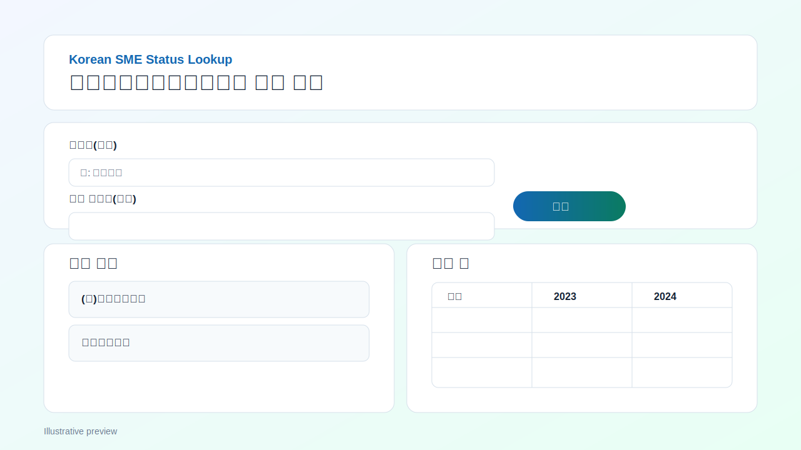
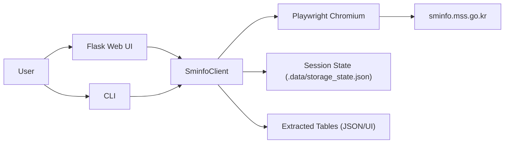

# Korean SME Status Lookup

Automation toolkit for searching Korean corporate records on `https://sminfo.mss.go.kr/` and extracting company performance tables.

- CLI: save session, search company, export JSON
- Web: submit query, select candidate, inspect extracted tables



## Tech Stack

- Python 3.11+
- Flask
- Playwright (Chromium)
- Gunicorn (production web server)

## Architecture



## Quick Start

```bash
cd /Users/jeonghoon/Documents/CodexApp/korean-sme-status-lookup
python3 -m venv .venv
source .venv/bin/activate
pip install -r requirements.txt
playwright install chromium
```

## Login Session

Recommended (manual login):

```bash
python -m sminfo_app.cli login
```

Optional (credential input):

```bash
python -m sminfo_app.cli login --id "YOUR_ID" --password "YOUR_PASSWORD"
```

Environment variable option:

```bash
export SMINFO_ID="YOUR_ID"
export SMINFO_PASSWORD="YOUR_PASSWORD"
python -m sminfo_app.cli login
```

## CLI Usage

```bash
python -m sminfo_app.cli status
python -m sminfo_app.cli search "회사명"
python -m sminfo_app.cli search "회사명" --company "정확한회사명"
python -m sminfo_app.cli search "회사명" --json ./out/result.json
```

## Run Web App

```bash
python -m sminfo_app.web
```

Open: `http://127.0.0.1:5050`

## Environment Variables

Copy from `.env.example` and override as needed:

- `SMINFO_TIMEOUT_MS`
- `SMINFO_STATE_PATH`
- `FLASK_DEBUG`
- `PORT`

## Deploy

### Render

This repo includes `/render.yaml` and `/Procfile`.

1. Create a new Web Service in Render from this GitHub repo.
2. Render reads `render.yaml` automatically.
3. Ensure build logs include Playwright Chromium install.
4. Deploy and open the generated URL.

### Railway

This repo includes `/railway.toml` and `/Procfile`.

1. Create a new Railway project from this GitHub repo.
2. Railway uses `railway.toml` start command.
3. Add required environment variables in Railway dashboard.
4. Deploy and open the generated URL.

## GitHub Repository Setup (Recommended)

Repository: [powermug/korean-sme-status-lookup](https://github.com/powermug/korean-sme-status-lookup)

Suggested **About** description:

`CLI + Web app for searching Korean SME company records and extracting annual performance tables from SMINFO.`

Suggested **Topics**:

`python`, `flask`, `playwright`, `web-automation`, `korea`, `sme`, `data-extraction`

## Security Notes

- Session file (`.data/storage_state.json`) contains authentication state. Treat it as sensitive.
- For stronger security, prefer manual login every session and avoid storing credentials.
- This project automates website UI flows (not an official API). Follow service terms and policy.

## License

MIT License. See `/LICENSE`.
